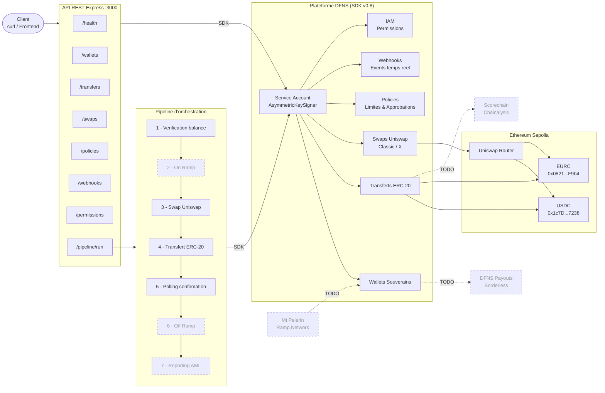

# DFNS Sovereign Transfer POC

POC Node.js / TypeScript pour l'orchestration de transferts souverains de stablecoins (USDC / EURC) via les APIs **DFNS** et le swap **Uniswap** integre.

---

## Architecture & Pipeline



## Structure du projet

```
dfns-sovereign-poc/
├── src/
│   ├── dfns/
│   │   ├── client.ts              # DfnsApiClient singleton + AsymmetricKeySigner
│   │   ├── retry.ts               # Retry avec backoff exponentiel (max 3)
│   │   └── logger.ts              # Logger structure pino
│   ├── wallets/
│   │   └── walletService.ts       # CRUD wallets, assets, history, multi-chain
│   ├── transfers/
│   │   └── transferService.ts     # Transferts ERC-20, polling, timeout
│   ├── swaps/
│   │   └── swapService.ts         # Quotes & swaps Uniswap via DFNS SDK
│   ├── policies/
│   │   └── policyService.ts       # Regles de gouvernance, approbations
│   ├── webhooks/
│   │   └── webhookService.ts      # Enregistrement webhooks, reception events
│   ├── iam/
│   │   └── permissionService.ts   # Permissions, assignments, service accounts
│   ├── orchestrator/
│   │   └── orchestrationPipeline.ts  # Pipeline complet de transfert
│   ├── api/
│   │   ├── routes.ts              # 24 endpoints Express
│   │   └── server.ts              # Configuration serveur Express
│   ├── config/
│   │   └── tokens.ts              # Adresses contrats stablecoins Sepolia
│   ├── __tests__/
│   │   ├── walletService.test.ts
│   │   ├── transferService.test.ts
│   │   └── orchestrationPipeline.test.ts
│   └── index.ts                   # Entrypoint
├── scripts/
│   └── accept-agreements.ts       # Acceptation T&C Uniswap
├── .env.example
├── .gitignore
├── package.json
├── tsconfig.json
├── vitest.config.ts
└── README.md
```

---

## Prerequis

- **Node.js 20+**
- **Compte DFNS** avec un Service Account configure
  - Guide : https://docs.dfns.co/guides/developers/creating-a-service-account
- **Sepolia ETH** pour les frais de gas : https://sepoliafaucet.com
- **USDC testnet** (Sepolia) : https://faucet.circle.com

---

## Installation

```bash
git clone <repo-url>
cd dfns-sovereign-poc
npm install
```

---

## Configuration

### 1. Generer une paire de cles RSA

```bash
openssl genrsa -out service-account.pem 2048
openssl pkey -in service-account.pem -pubout -out service-account.public.pem
```

### 2. Creer le Service Account dans DFNS

1. Dashboard DFNS : **Settings > Developers > Service Accounts > New Service Account**
2. Coller le contenu de `service-account.public.pem`
3. Confirmer avec passkey
4. **Copier immediatement** le Token (affiche une seule fois) et le Credential ID

### 3. Remplir le fichier `.env`

```bash
cp .env.example .env
```

| Variable | Source | Description |
|----------|--------|-------------|
| `DFNS_AUTH_TOKEN` | Dashboard (etape 2) | JWT du Service Account |
| `DFNS_CRED_ID` | Dashboard (etape 2) | Credential ID |
| `DFNS_PRIVATE_KEY` | `service-account.pem` | Cle privee PEM (remplacer `\n` par `\\n`) |
| `DFNS_BASE_URL` | Fixe | `https://api.dfns.io` |
| `PORT` | Optionnel | Port du serveur (defaut: `3000`) |

Formater la cle privee pour le `.env` :

```bash
awk 'NF {sub(/\r/, ""); printf "%s\\n",$0;}' service-account.pem
```

### 4. Accepter les Terms & Conditions Uniswap

```bash
npx tsx scripts/accept-agreements.ts
```

---

## Demarrage

```bash
npm run dev
```

Le serveur demarre sur `http://localhost:3000`.

---

## Modules

| # | Module | Fichier | Description |
|---|--------|---------|-------------|
| 1 | Client DFNS | `src/dfns/client.ts` | Singleton `DfnsApiClient` avec `AsymmetricKeySigner` (SDK v0.8) |
| 2 | Wallets | `src/wallets/walletService.ts` | Creation, listing, assets, historique, multi-chain |
| 3 | Transferts | `src/transfers/transferService.ts` | Transferts ERC-20 (USDC/EURC), polling avec timeout |
| 4 | Swaps | `src/swaps/swapService.ts` | Quotes et swaps via Uniswap (UniswapClassic / UniswapX) |
| 5 | Policies | `src/policies/policyService.ts` | Limites de transfert, approbations, gouvernance |
| 6 | Webhooks | `src/webhooks/webhookService.ts` | Enregistrement webhooks, reception events temps reel |
| 7 | IAM | `src/iam/permissionService.ts` | Permissions, assignments, service accounts |
| 8 | Orchestrateur | `src/orchestrator/orchestrationPipeline.ts` | Pipeline : balance -> swap -> transfert -> confirmation |
| 9 | API REST | `src/api/routes.ts` | 24 endpoints Express |

---

## Endpoints API

### Wallets

| Methode | Route | Description |
|---------|-------|-------------|
| `POST` | `/wallets` | Creer un wallet souverain |
| `GET` | `/wallets` | Lister les wallets |
| `GET` | `/wallets/:id/assets` | Balances du wallet |
| `GET` | `/wallets/:id/history` | Historique du wallet |

### Transferts

| Methode | Route | Description |
|---------|-------|-------------|
| `POST` | `/transfers` | Declencher un transfert ERC-20 |
| `GET` | `/transfers/:walletId/:transferId` | Statut d'un transfert |

### Swaps

| Methode | Route | Description |
|---------|-------|-------------|
| `POST` | `/swaps/quote` | Obtenir un quote swap (Uniswap) |
| `POST` | `/swaps` | Executer un swap |
| `GET` | `/swaps/:id` | Statut d'un swap |

### Policies

| Methode | Route | Description |
|---------|-------|-------------|
| `GET` | `/policies` | Lister les policies actives |
| `POST` | `/policies/transfer-limit` | Creer une policy de limite de transfert |
| `POST` | `/policies/approval` | Creer une policy d'approbation |
| `GET` | `/policies/approvals/pending` | Lister les approbations en attente |
| `PUT` | `/policies/approvals/:id/approve` | Approuver une action |

### Webhooks

| Methode | Route | Description |
|---------|-------|-------------|
| `POST` | `/webhooks` | Enregistrer un webhook DFNS |
| `GET` | `/webhooks` | Lister les webhooks |
| `GET` | `/webhooks/:id/events` | Events d'un webhook |
| `POST` | `/webhook/receiver` | Recepteur d'events DFNS |
| `GET` | `/webhook/events` | Events recus localement |

### IAM / Permissions

| Methode | Route | Description |
|---------|-------|-------------|
| `POST` | `/permissions` | Creer la permission orchestrateur |
| `POST` | `/permissions/:id/assign` | Assigner une permission a un utilisateur |
| `POST` | `/service-accounts` | Creer un service account |

### Orchestration

| Methode | Route | Description |
|---------|-------|-------------|
| `POST` | `/pipeline/run` | Lancer le pipeline complet |
| `GET` | `/health` | Health check |

---

## Exemples d'utilisation

### Creer un wallet souverain

```bash
curl -X POST http://localhost:3000/wallets \
  -H "Content-Type: application/json" \
  -d '{"name": "mon-wallet"}'
```

### Transfert USDC (1 USDC = 1000000 unites)

```bash
curl -X POST http://localhost:3000/transfers \
  -H "Content-Type: application/json" \
  -d '{
    "walletId": "wa-xxxxx-xxxxx-xxxxxxxxxxxxxxxx",
    "contract": "0x1c7D4B196Cb0C7B01d743Fbc6116a902379C7238",
    "to": "0xDestinataire...",
    "amount": "1000000"
  }'
```

### Swap ETH vers USDC (0.005 ETH)

```bash
# 1. Obtenir un quote
curl -X POST http://localhost:3000/swaps/quote \
  -H "Content-Type: application/json" \
  -d '{
    "walletId": "wa-xxxxx-xxxxx-xxxxxxxxxxxxxxxx",
    "targetContract": "0x1c7D4B196Cb0C7B01d743Fbc6116a902379C7238",
    "amount": "5000000000000000",
    "provider": "UniswapClassic"
  }'

# 2. Executer le swap (avec les donnees du quote)
curl -X POST http://localhost:3000/swaps \
  -H "Content-Type: application/json" \
  -d '{
    "walletId": "wa-xxxxx-xxxxx-xxxxxxxxxxxxxxxx",
    "quoteId": "swapQuote-xxxxx-xxxxx-xxxxxxxxxxxxxxxx",
    "provider": "UniswapClassic",
    "slippageBps": 100,
    "sourceAsset": {"kind": "Native", "amount": "5000000000000000"},
    "targetAsset": {"kind": "Erc20", "contract": "0x1c7D...", "amount": "27781584"}
  }'
```

### Pipeline complet (transfert simple)

```bash
curl -X POST http://localhost:3000/pipeline/run \
  -H "Content-Type: application/json" \
  -d '{
    "senderWalletId": "wa-xxxxx-xxxxx-xxxxxxxxxxxxxxxx",
    "recipientAddress": "0xDestinataire...",
    "amount": "1000000",
    "tokenContract": "0x1c7D4B196Cb0C7B01d743Fbc6116a902379C7238"
  }'
```

### Pipeline avec swap (EURC vers USDC puis transfert)

```bash
curl -X POST http://localhost:3000/pipeline/run \
  -H "Content-Type: application/json" \
  -d '{
    "senderWalletId": "wa-xxxxx-xxxxx-xxxxxxxxxxxxxxxx",
    "recipientAddress": "0xDestinataire...",
    "amount": "1000000",
    "tokenContract": "0x08210F9170F89Ab7658F0B5E3fF39b0E03C594D4",
    "requireSwap": true,
    "swapTargetContract": "0x1c7D4B196Cb0C7B01d743Fbc6116a902379C7238"
  }'
```

### Creer une policy de limite de transfert

```bash
curl -X POST http://localhost:3000/policies/transfer-limit \
  -H "Content-Type: application/json" \
  -d '{
    "name": "Limite 10k USD",
    "limitUsd": 10000,
    "approverUserIds": ["us-xxxxx-xxxxx-xxxxxxxxxxxxxxxx"]
  }'
```

---

## Tests

```bash
# Lancer les tests
npm test

# Mode watch
npm run test:watch

# Verification TypeScript (strict)
npm run typecheck
```

3 suites de tests, 15 tests unitaires couvrant les wallets, transferts et le pipeline d'orchestration.

---

## Robustesse

| Mecanisme | Detail |
|-----------|--------|
| Retry | Backoff exponentiel (500ms, 1s, 2s) sur tous les appels DFNS |
| Timeout | 5 minutes max pour le polling des transferts et swaps |
| Logging | Structure via `pino` avec niveaux `info`, `warn`, `error` |
| Typage | TypeScript strict, tous les retours DFNS types via le SDK |
| Signature | `AsymmetricKeySigner` signe automatiquement les requetes mutantes |

---

## Stack technique

| Composant | Technologie |
|-----------|-------------|
| Runtime | Node.js 20+ / TypeScript strict |
| SDK | `@dfns/sdk` v0.8 + `@dfns/sdk-keysigner` v0.8 |
| Blockchain | Ethereum Sepolia (testnet) |
| Stablecoins | USDC (`0x1c7D...7238`) / EURC (`0x0821...F9b4`) |
| Swaps | Uniswap (UniswapClassic / UniswapX) via DFNS |
| Framework | Express.js |
| Tests | Vitest |
| Logging | Pino |

---

## Integrations futures (TODO)

| Etape | Service | Statut |
|-------|---------|--------|
| On Ramp (fiat vers crypto) | Mt Pelerin / Ramp.Network / Sardine | A integrer |
| Off Ramp (crypto vers fiat) | DFNS Payouts (Borderless) | API disponible |
| Reporting AML/KYT | Chainalysis / Scorechain | A integrer |
| Travel Rule | Notabene | A integrer |

---

## Reseau

Ce POC utilise exclusivement **Ethereum Sepolia** (testnet). Aucune cle mainnet n'est utilisee.
