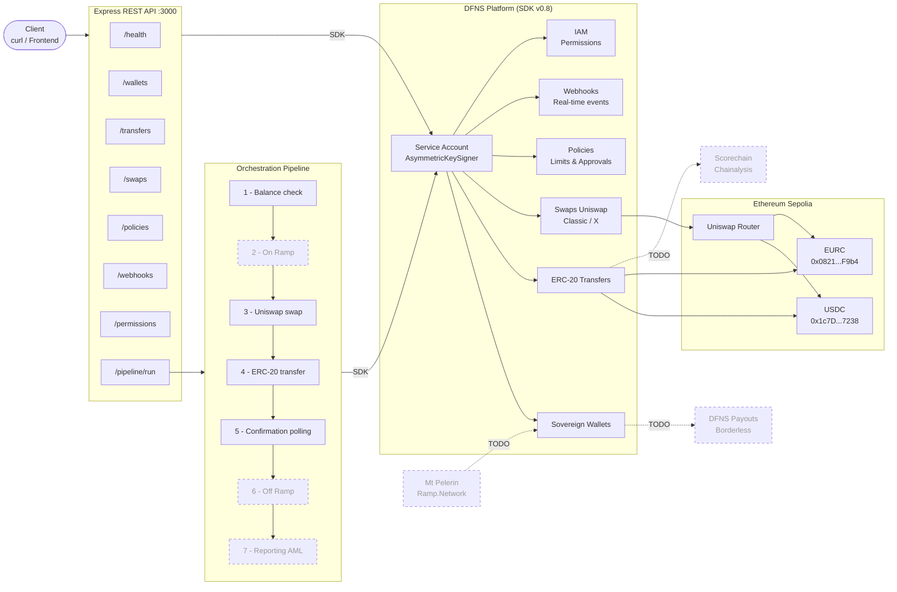

# DFNS Sovereign Transfer POC

Node.js / TypeScript POC for orchestrating sovereign stablecoin transfers (USDC / EURC) through the **DFNS** APIs and integrated **Uniswap** swaps.

---

## Architecture & Pipeline



## Project Structure

```
dfns-sovereign-poc/
├── src/
│   ├── dfns/
│   │   ├── client.ts              # DfnsApiClient singleton + AsymmetricKeySigner
│   │   ├── retry.ts               # Retry with exponential backoff (max 3)
│   │   └── logger.ts              # Structured pino logger
│   ├── wallets/
│   │   └── walletService.ts       # CRUD wallets, assets, history, multi-chain
│   ├── transfers/
│   │   └── transferService.ts     # ERC-20 transfers, polling, timeout
│   ├── swaps/
│   │   └── swapService.ts         # Quotes & swaps Uniswap via DFNS SDK
│   ├── policies/
│   │   └── policyService.ts       # Governance rules, approvals
│   ├── webhooks/
│   │   └── webhookService.ts      # Webhook registration, event receiving
│   ├── iam/
│   │   └── permissionService.ts   # Permissions, assignments, service accounts
│   ├── orchestrator/
│   │   └── orchestrationPipeline.ts  # Complete transfer pipeline
│   ├── api/
│   │   ├── routes.ts              # 24 endpoints Express
│   │   └── server.ts              # Express server configuration
│   ├── config/
│   │   └── tokens.ts              # Sepolia stablecoin contract addresses
│   ├── __tests__/
│   │   ├── walletService.test.ts
│   │   ├── transferService.test.ts
│   │   └── orchestrationPipeline.test.ts
│   └── index.ts                   # Entrypoint
├── scripts/
│   └── accept-agreements.ts       # Uniswap T&C acceptance
├── .env.example
├── .gitignore
├── package.json
├── tsconfig.json
├── vitest.config.ts
└── README.md
```

---

## Prerequisites

- **Node.js 20+**
- **DFNS account** with a configured Service Account
  - Guide: https://docs.dfns.co/guides/developers/creating-a-service-account
- **Sepolia ETH** for gas fees: https://sepoliafaucet.com
- **USDC testnet** (Sepolia): https://faucet.circle.com

---

## Installation

```bash
git clone <repo-url>
cd dfns-sovereign-poc
npm install
```

---

## Configuration

### 1. Generate an RSA key pair

```bash
openssl genrsa -out service-account.pem 2048
openssl pkey -in service-account.pem -pubout -out service-account.public.pem
```

### 2. Create the Service Account in DFNS

1. DFNS Dashboard: **Settings > Developers > Service Accounts > New Service Account**
2. Paste the contents of `service-account.public.pem`
3. Confirm with passkey
4. **Copy the Token immediately** (shown only once) and the Credential ID

### 3. Fill in the `.env` file

```bash
cp .env.example .env
```

| Variable | Source | Description |
|----------|--------|-------------|
| `DFNS_AUTH_TOKEN` | Dashboard (step 2) | Service Account JWT |
| `DFNS_CRED_ID` | Dashboard (step 2) | Credential ID |
| `DFNS_PRIVATE_KEY` | `service-account.pem` | PEM private key (replace `\n` with `\\n`) |
| `DFNS_BASE_URL` | Fixed | `https://api.dfns.io` |
| `PORT` | Optional | Server port (default: `3000`) |

Format the private key for `.env`:

```bash
awk 'NF {sub(/\r/, ""); printf "%s\\n",$0;}' service-account.pem
```

### 4. Accept the Uniswap Terms & Conditions

```bash
npx tsx scripts/accept-agreements.ts
```

---

## Startup

```bash
npm run dev
```

The server starts on `http://localhost:3000`.

---

## Modules

| # | Module | File | Description |
|---|--------|---------|-------------|
| 1 | DFNS Client | `src/dfns/client.ts` | `DfnsApiClient` singleton with `AsymmetricKeySigner` (SDK v0.8) |
| 2 | Wallets | `src/wallets/walletService.ts` | Creation, listing, assets, history, multi-chain |
| 3 | Transfers | `src/transfers/transferService.ts` | ERC-20 transfers (USDC/EURC), polling with timeout |
| 4 | Swaps | `src/swaps/swapService.ts` | Quotes and swaps via Uniswap (UniswapClassic / UniswapX) |
| 5 | Policies | `src/policies/policyService.ts` | Transfer limits, approvals, governance |
| 6 | Webhooks | `src/webhooks/webhookService.ts` | Webhook registration, real-time event receiving |
| 7 | IAM | `src/iam/permissionService.ts` | Permissions, assignments, service accounts |
| 8 | Orchestrator | `src/orchestrator/orchestrationPipeline.ts` | Pipeline: balance -> swap -> transfer -> confirmation |
| 9 | API REST | `src/api/routes.ts` | 24 endpoints Express |

---

## API Endpoints

### Wallets

| Method | Route | Description |
|---------|-------|-------------|
| `POST` | `/wallets` | Create a sovereign wallet |
| `GET` | `/wallets` | List wallets |
| `GET` | `/wallets/:id/assets` | Wallet balances |
| `GET` | `/wallets/:id/history` | Wallet history |

### Transfers

| Method | Route | Description |
|---------|-------|-------------|
| `POST` | `/transfers` | Trigger an ERC-20 transfer |
| `GET` | `/transfers/:walletId/:transferId` | Transfer status |

### Swaps

| Method | Route | Description |
|---------|-------|-------------|
| `POST` | `/swaps/quote` | Get a swap quote (Uniswap) |
| `POST` | `/swaps` | Execute a swap |
| `GET` | `/swaps/:id` | Swap status |

### Policies

| Method | Route | Description |
|---------|-------|-------------|
| `GET` | `/policies` | List active policies |
| `POST` | `/policies/transfer-limit` | Create a transfer limit policy |
| `POST` | `/policies/approval` | Create an approval policy |
| `GET` | `/policies/approvals/pending` | List pending approvals |
| `PUT` | `/policies/approvals/:id/approve` | Approve an action |

### Webhooks

| Method | Route | Description |
|---------|-------|-------------|
| `POST` | `/webhooks` | Register a DFNS webhook |
| `GET` | `/webhooks` | List webhooks |
| `GET` | `/webhooks/:id/events` | Webhook events |
| `POST` | `/webhook/receiver` | DFNS event receiver |
| `GET` | `/webhook/events` | Locally received events |

### IAM / Permissions

| Method | Route | Description |
|---------|-------|-------------|
| `POST` | `/permissions` | Create the orchestrator permission |
| `POST` | `/permissions/:id/assign` | Assign a permission to a user |
| `POST` | `/service-accounts` | Create a service account |

### Orchestration

| Method | Route | Description |
|---------|-------|-------------|
| `POST` | `/pipeline/run` | Run the complete pipeline |
| `GET` | `/health` | Health check |

---

## Usage Examples

### Create a sovereign wallet

```bash
curl -X POST http://localhost:3000/wallets \
  -H "Content-Type: application/json" \
  -d '{"name": "my-wallet"}'
```

### USDC transfer (1 USDC = 1,000,000 units)

```bash
curl -X POST http://localhost:3000/transfers \
  -H "Content-Type: application/json" \
  -d '{
    "walletId": "wa-xxxxx-xxxxx-xxxxxxxxxxxxxxxx",
    "contract": "0x1c7D4B196Cb0C7B01d743Fbc6116a902379C7238",
    "to": "0xRecipient...",
    "amount": "1000000"
  }'
```

### Swap ETH to USDC (0.005 ETH)

```bash
# 1. Get a quote
curl -X POST http://localhost:3000/swaps/quote \
  -H "Content-Type: application/json" \
  -d '{
    "walletId": "wa-xxxxx-xxxxx-xxxxxxxxxxxxxxxx",
    "targetContract": "0x1c7D4B196Cb0C7B01d743Fbc6116a902379C7238",
    "amount": "5000000000000000",
    "provider": "UniswapClassic"
  }'

# 2. Execute the swap (with quote data)
curl -X POST http://localhost:3000/swaps \
  -H "Content-Type: application/json" \
  -d '{
    "walletId": "wa-xxxxx-xxxxx-xxxxxxxxxxxxxxxx",
    "quoteId": "swapQuote-xxxxx-xxxxx-xxxxxxxxxxxxxxxx",
    "provider": "UniswapClassic",
    "slippageBps": 100,
    "sourceAsset": {"kind": "Native", "amount": "5000000000000000"},
    "targetAsset": {"kind": "Erc20", "contract": "0x1c7D...", "amount": "27781584"}
  }'
```

### Complete pipeline (simple transfer)

```bash
curl -X POST http://localhost:3000/pipeline/run \
  -H "Content-Type: application/json" \
  -d '{
    "senderWalletId": "wa-xxxxx-xxxxx-xxxxxxxxxxxxxxxx",
    "recipientAddress": "0xRecipient...",
    "amount": "1000000",
    "tokenContract": "0x1c7D4B196Cb0C7B01d743Fbc6116a902379C7238"
  }'
```

### Pipeline with swap (EURC to USDC, then transfer)

```bash
curl -X POST http://localhost:3000/pipeline/run \
  -H "Content-Type: application/json" \
  -d '{
    "senderWalletId": "wa-xxxxx-xxxxx-xxxxxxxxxxxxxxxx",
    "recipientAddress": "0xRecipient...",
    "amount": "1000000",
    "tokenContract": "0x08210F9170F89Ab7658F0B5E3fF39b0E03C594D4",
    "requireSwap": true,
    "swapTargetContract": "0x1c7D4B196Cb0C7B01d743Fbc6116a902379C7238"
  }'
```

### Create a transfer limit policy

```bash
curl -X POST http://localhost:3000/policies/transfer-limit \
  -H "Content-Type: application/json" \
  -d '{
    "name": "10k USD Limit",
    "limitUsd": 10000,
    "approverUserIds": ["us-xxxxx-xxxxx-xxxxxxxxxxxxxxxx"]
  }'
```

---

## Tests

```bash
# Run tests
npm test

# Watch mode
npm run test:watch

# TypeScript verification (strict)
npm run typecheck
```

3 test suites, 15 unit tests covering wallets, transfers, and the orchestration pipeline.

---

## Robustness

| Mechanism | Detail |
|-----------|--------|
| Retry | Exponential backoff (500ms, 1s, 2s) on all DFNS calls |
| Timeout | 5 minutes max for transfer and swap polling |
| Logging | Structured via `pino` with `info`, `warn`, and `error` levels |
| Typing | Strict TypeScript, all DFNS responses typed through the SDK |
| Signature | `AsymmetricKeySigner` automatically signs mutating requests |

---

## Technical Stack

| Component | Technology |
|-----------|-------------|
| Runtime | Node.js 20+ / TypeScript strict |
| SDK | `@dfns/sdk` v0.8 + `@dfns/sdk-keysigner` v0.8 |
| Blockchain | Ethereum Sepolia (testnet) |
| Stablecoins | USDC (`0x1c7D...7238`) / EURC (`0x0821...F9b4`) |
| Swaps | Uniswap (UniswapClassic / UniswapX) via DFNS |
| Framework | Express.js |
| Tests | Vitest |
| Logging | Pino |

---

## Future Integrations (TODO)

| Step | Service | Status |
|-------|---------|--------|
| On Ramp (fiat to crypto) | Mt Pelerin / Ramp.Network / Sardine | To integrate |
| Off Ramp (crypto to fiat) | DFNS Payouts (Borderless) | API available |
| AML/KYT Reporting | Chainalysis / Scorechain | To integrate |
| Travel Rule | Notabene | To integrate |

---

## Network

This POC exclusively uses **Ethereum Sepolia** (testnet). No mainnet key is used.
